# Nashville EDA

EDA of data from the Nashville Open Data Portal.

## Table of Contents

* [BLUF](#bottom-line-up-front)
* [Data](#data)
* [Results](#results)
* [Conclusion](#conclusion)

## Bottom Line Up Front

* Live in the western half of Nashville, TN.
* Lock everything when you're at work.
* Get home at a reasonable hour.

## Data

There are 6,374,126 rows and 19 features containing details about emergency and non-emergency calls for [Metro Nashville Police Department](https://data.nashville.gov/Police/Metro-Nashville-Police-Department-Calls-for-Servic/kwnd-qrrm) service received by the Emergency Communications Center. The data is complied daily and spans from January 1, 2015 to January 17, 2022.

### Cleaning

Many of the features contained redundant data or were determined to be unneeded for this analyis. The features kept are in the table below followed by a data dictionary.

| # |  Column | Dtype |
| --- | ------ | ----- |
| 0 | Event Number | object |
| 1 | Call Received | object |
| 2 | Complaint Number | float64 |
| 3 | Tencode | int64 |
| 4 | Disposition Code | object |
| 5 | Unit Dispatched | object |
| 6 | Shift | object |
| 7 | Latitude | float64 |
| 8 | Longitude | float64 |

* `Event Number`: Automatically generated CAD system ID number
* `Call Received`: Date and time the call was answered by the ECC
* `Complaint Number`: MNPD incident number for the call, if an incident is generated for the call (not all calls generate incident reports)
* `Tencode`: Abbreviated codes used to represent common phrases used to describe the call
* `Disposition Code`: Code used to describe the outcome of the call
* `Unit Dispatched`: Callsign of the officer responding to the call
* `Shift`: ECC shift during which the call occurred (A for day shift, B for evening shift, C for night shift)
* `Latitude`: Rounded latitude for the call
* `Longitude`: Rounded longitude for the call

The only feature the required engineering was the `Tencode`. There is a suffix that is attached to some of the codes that provides some applifying information. This was removed due to its sparse use to provide a better clarity with fewer possibilities.

The data was split into three dataframes based upon the `Tencode`: `Theft`, `Vehicle`, and `Violent`. Most of the `Tencodes` were quite simply to organize, e.g. `Holdup/Robbery` -> `Theft`, `Vehicle Accident-Property Damage` -> `Vehicle`, `Fight / Assault` -> `Violent`.

Lastly, some rows were removed due to having suplicated `Event Numbers`. This was considered errant. The only row kept contained the fewest `NaN` values.

## Results

Each of these three categories were assessed for trends based upon the desnity of the data, geographical commonalities, and distributions.

***HELPFUL HINTS***

* Plot Colors
    * `Theft` -> BLUE
    * `Vehicle` -> GREEN
    * `Violent` -> RED
    * `Mean Value` -> ORANGE

### Nullity Matrices

#### Summary

The most sparse features were `Complaint Number`, `Latitude`, and `Longitude`. The `Violent` data had the least missing data with the `Vehicle` data having the most, this is especially true for the `Complaint Number`. This suggests that the reporting practices are more thorough when there is a more severe infraction.

#### Theft

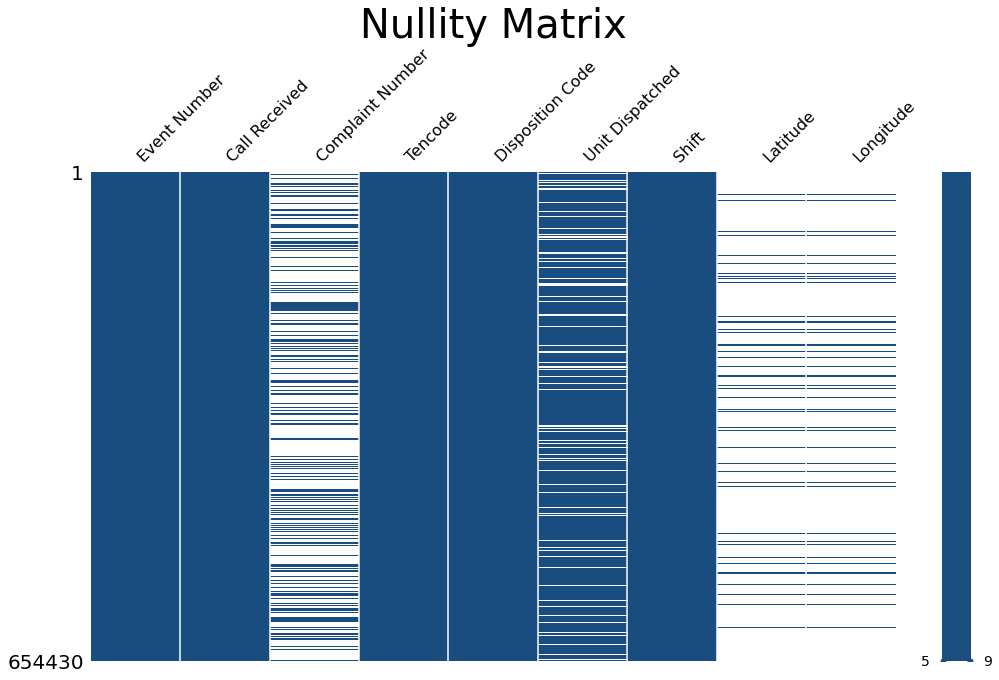

#### Vehicle

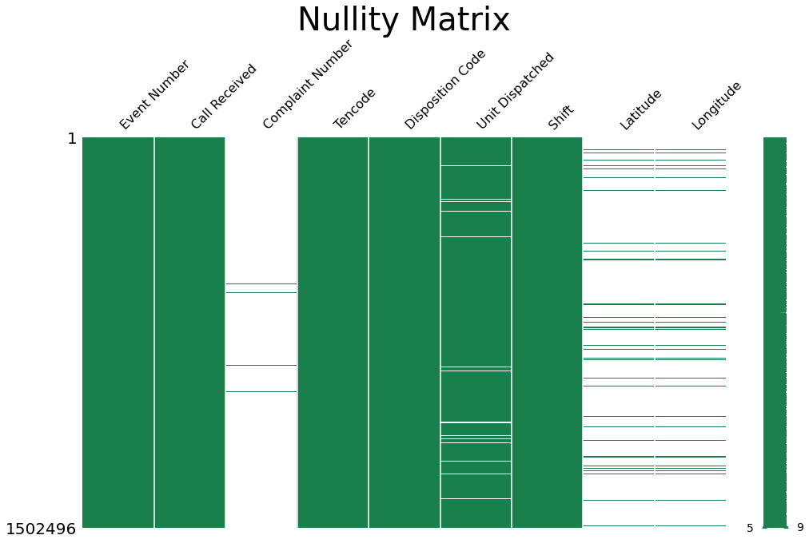

#### Violent

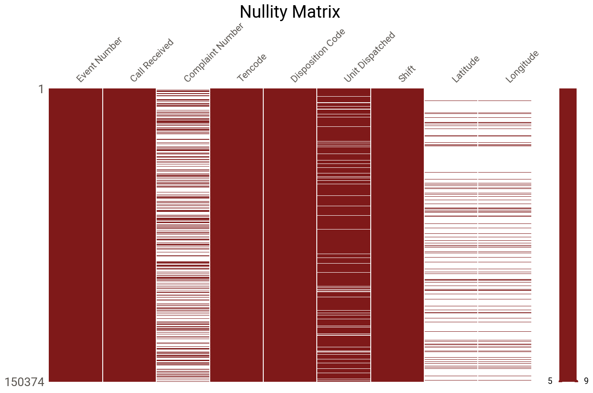

### Geographical Commonalities

#### Summary

There are three regions on the eastern outskirts of Nashville, TN that have the a greater freqency of emergency and non-emergency calls reagrding thefts, vehicular accidents and citations, and violent crime. Many of the major thoroughfares that run through the city, e.g. 41A, 31E, 70, have comparable problems.

#### Theft

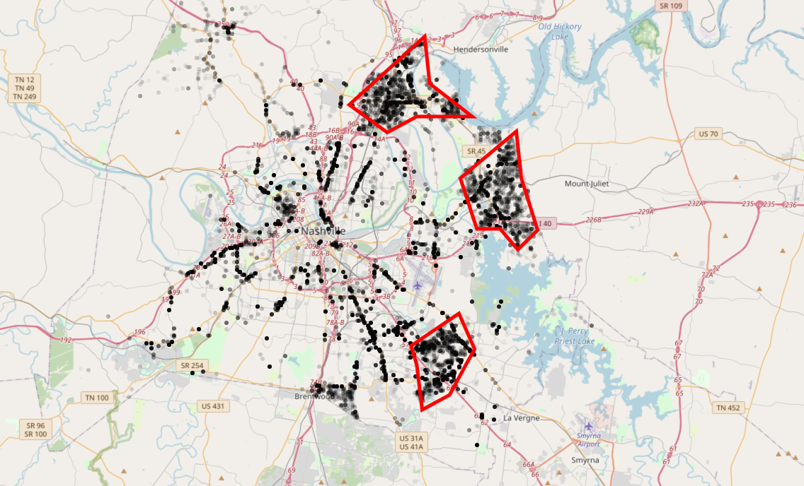

#### Vehicle

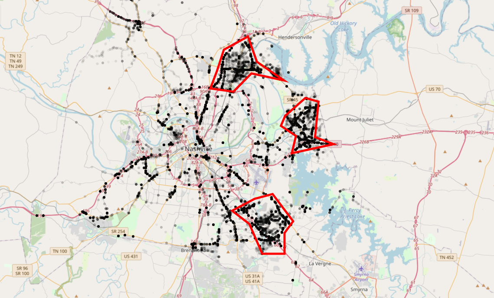

#### Violent

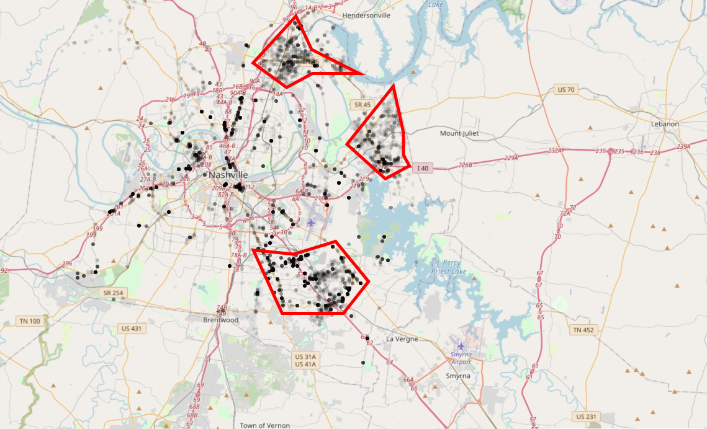

### Tencode Distributions

#### Theft

While `Theft` occurs in great numbers that the other `Tencodes`, the other four codes can be combined as violent theft since they all involve in knowledge and intention of theft where someone is or may have been endangered.

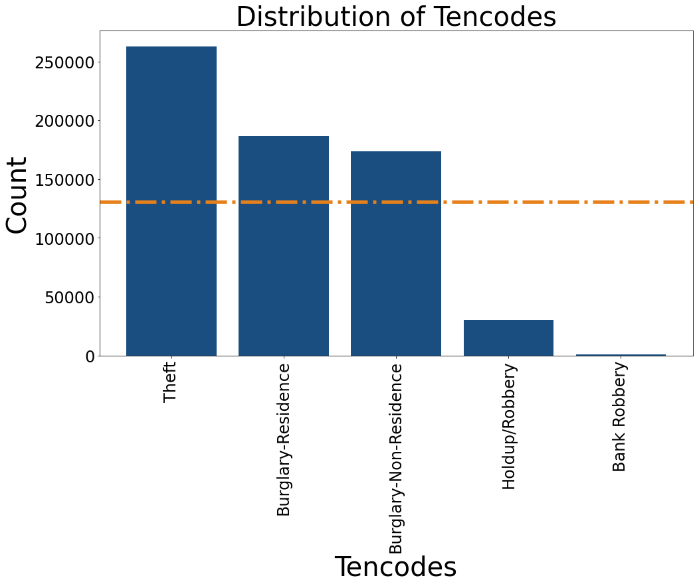

#### Vehicle

`Traffic Violations` are by far the most common vehicular incident with accident occuring relatively infrequently.

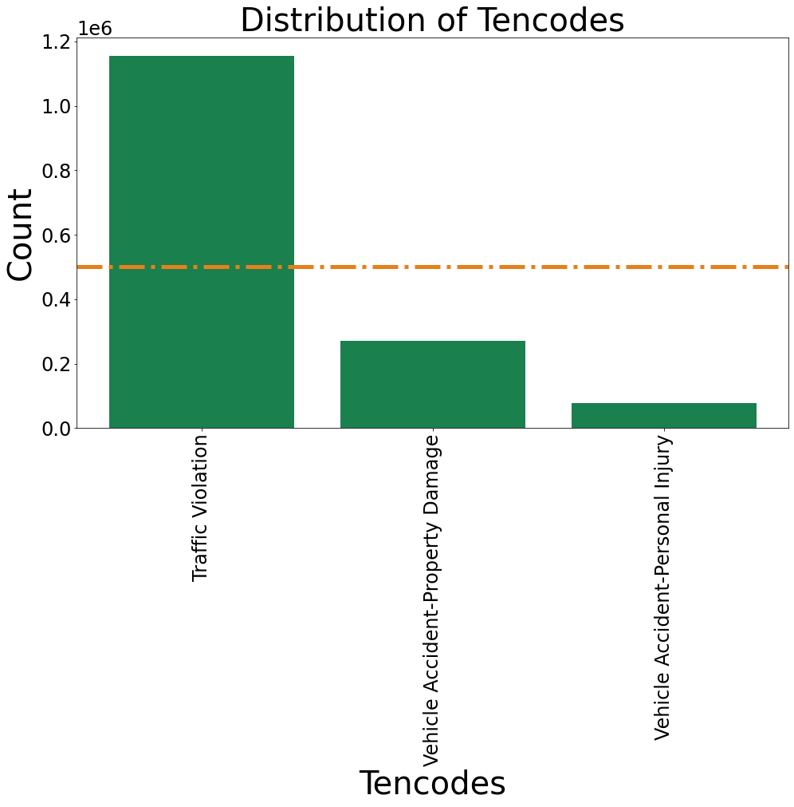

#### Violent

While `Fighting` and `Shots` being fired are the most common violent interaction the results in a call to MNPD, they do not often result in a `Shooting`.

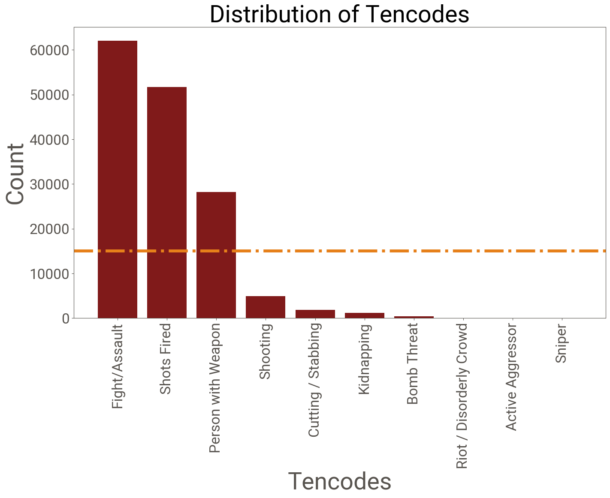

### Time-Based Distributions

#### Theft

`Theft` is most prominent when most people are at work or running errands (0700 - 1900). There is no consistent trend year-over-year or by month.

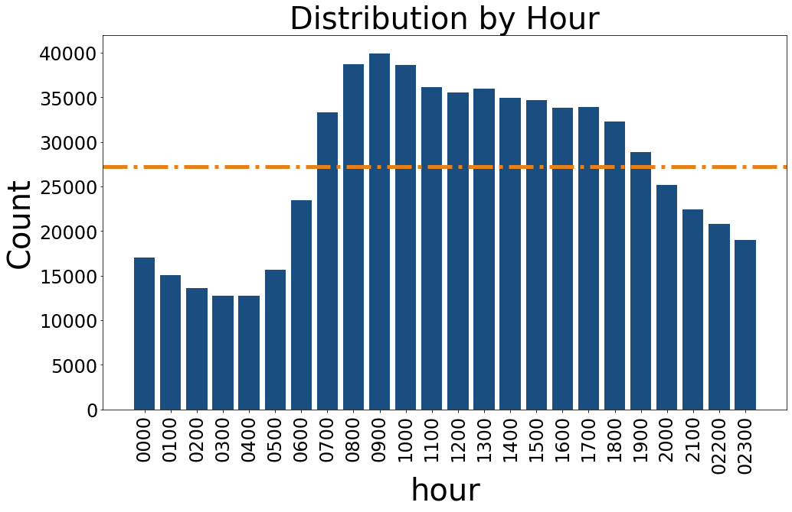

#### Vehicle

While there is little signal in the monthly and hourly distributions, there has been a steep decline in MNPD calls regarding vehicular incidents in recent years.

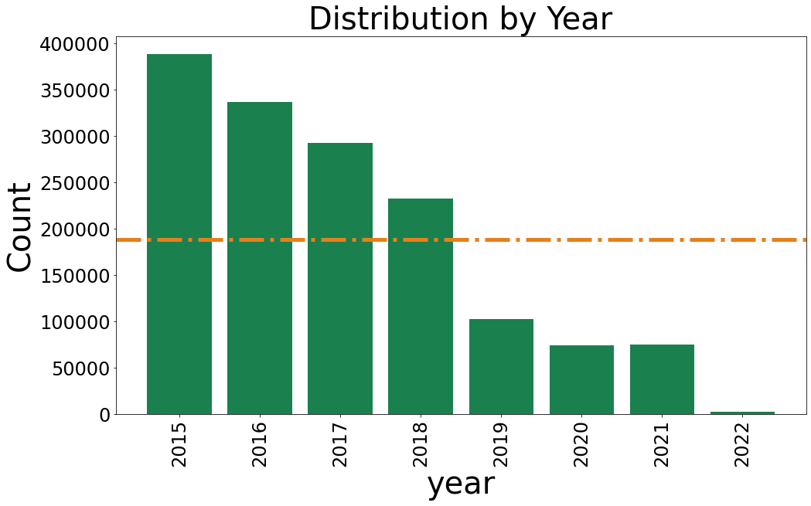

#### Violent

Most of the `violent` interactions occur during 1700 and 0000 when individuals are less likely to be at work and are more likely to be socializing.

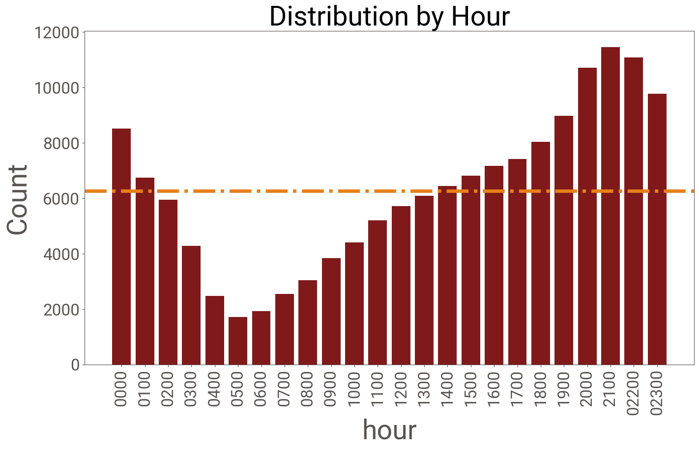

## Conclusion

There are many areas in Nashville that do not commonly have theft, vehicular incidents, or violent crime. These areas tend to be on the western half od the city and away from major throughfares.

Most of the thefts occur when indivduals are more likely at work and suggests the the offenders are seeking targets of opportunity.

Driving has become safer in recent years

Individuals are more likely to be violent in the evening. This coincides with when nightlife is more vibrant in Nashville. It is suggested to avoid late nights Downtown or in the western half of the city.
